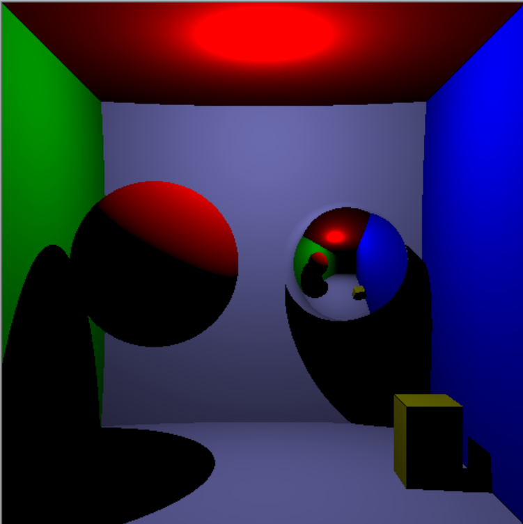

# Raytracing

L’objectif est de représenter une scène 3D sur un écran avec le **lancer de rayons**. Ce procédé permet d’avoir un rendu plus réaliste qu’une simple rastérisation. Il fonctionne en lançant des **rayons** depuis l'œil (ou la caméra) vers les pixels de l’écran. Si un rayon intersecte un objet, la couleur de cet objet est appliquée au pixel. Sinon, le pixel reste noir. 

Cette technique a été appliquée pour créer une scène 3D contenant :
- Deux **sphères** et un **cube**.
- Une **source de lumière** accrochée au plafond.

<p align="center">
    
</p>

Le code a été réalisé en **C++** et avec la bibliothèque **SDL**. Le code peut être compilé avec :

```bash
g++ -g -Wall -Wextra -o projet *.cpp `pkg-config --cflags --libs sdl2`
```

Ce projet a été réalisé en décembre 2023.


